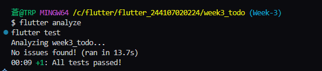
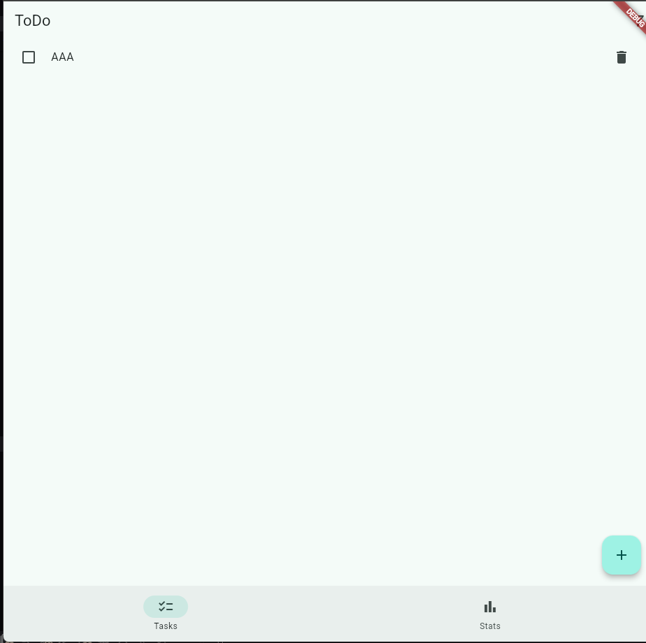
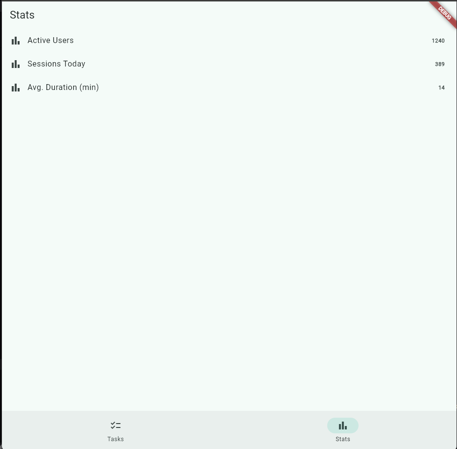
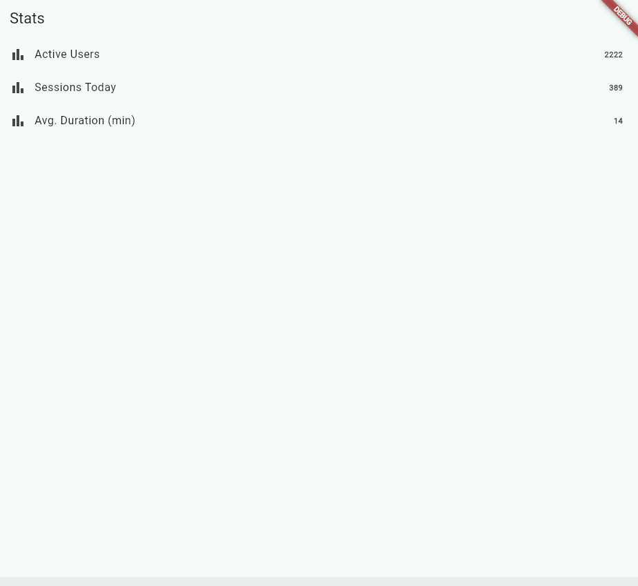

# Lab 1 

## Inside of the Item

# Lab 2 

## Adding Task

## Task when it's Completed

# Lab 3

# AI Challenge

# Flutter Analyze & Flutter Test

# Assignment 

## Data Changed in Stat Page

## Reflection

**When is setState still enough, and when should state be lifted into Riverpod?**
 setState  is fine for stuff that's local and disposable, like whether a dialog is open, or a filter toggle on one page. Once other widgets need to read that same state, or it needs to survive across pages, or it involves async work like a network call, it belongs in Riverpod instead.

**Difference between context.go and  context.push ?**
 context.go  replaces the current screen.  context.push  stacks a new screen on top, so back button still works. Use  go for tab style navigation (like switching bottom nav tabs), and  push  when you want the user to be able to return to where they came from (like opening a detail page).

**How does  AsyncValue  prevent bugs compared to three separate booleans?**
With three booleans ( isLoading ,  hasError ,  hasData ), nothing stops them from contradicting each other — you could end up with loading and data both true at once.  AsyncValue  only allows one state at a time (loading, error, or data), and  .when()  forces you to handle all three, so you can't forget a case or end up in a broken combination.

**Which part of the AI output did you fix, and why?**
The test kept failing because  tester.pump()  only advances one frame, so it caught the "Add" dialog mid-close animation and found duplicate text on screen. Switching to  tester.pumpAndSettle()  let the animation finish before checking, which fixed it without touching any app code.