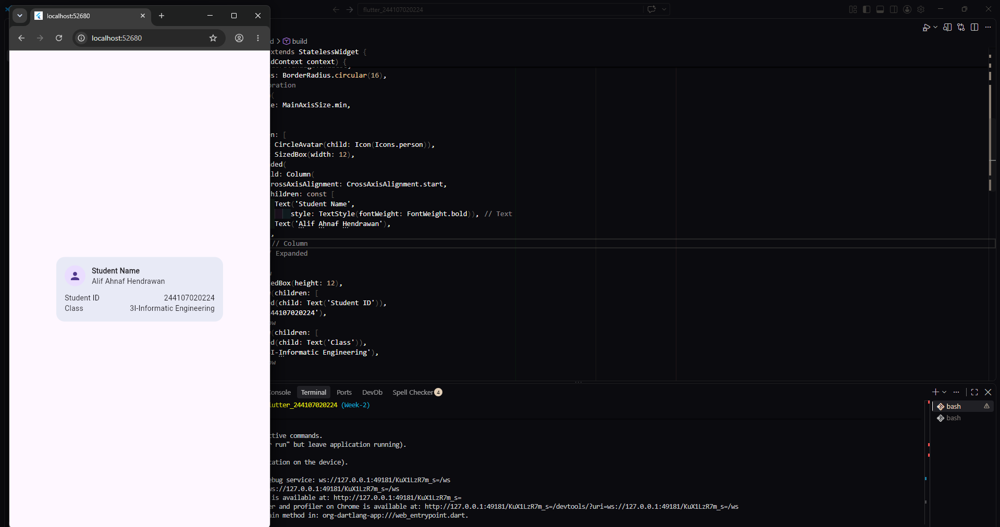
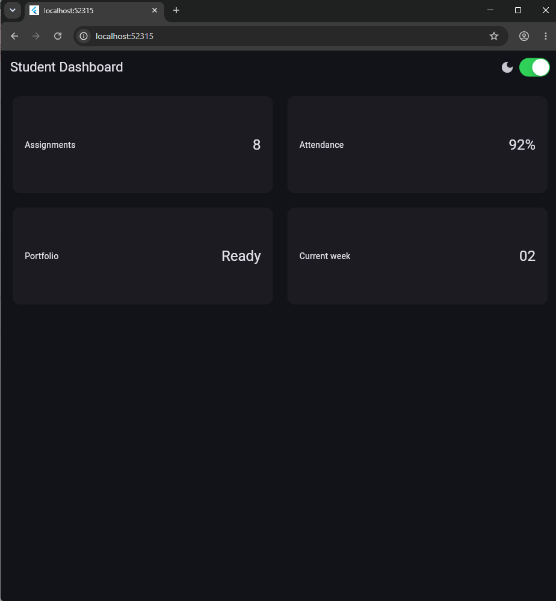
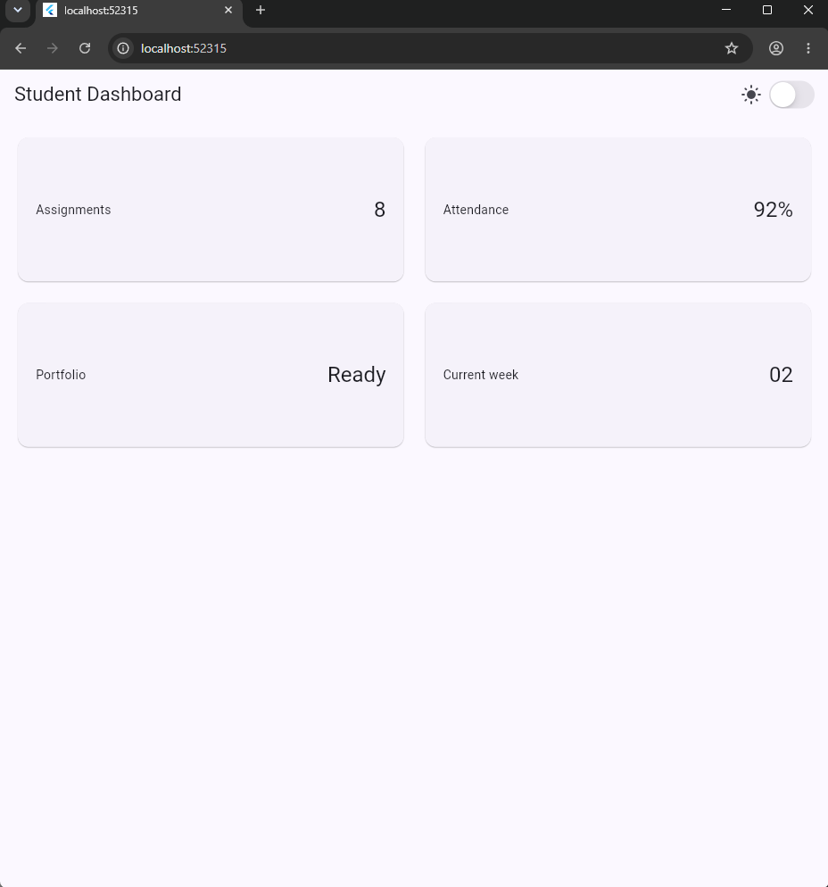
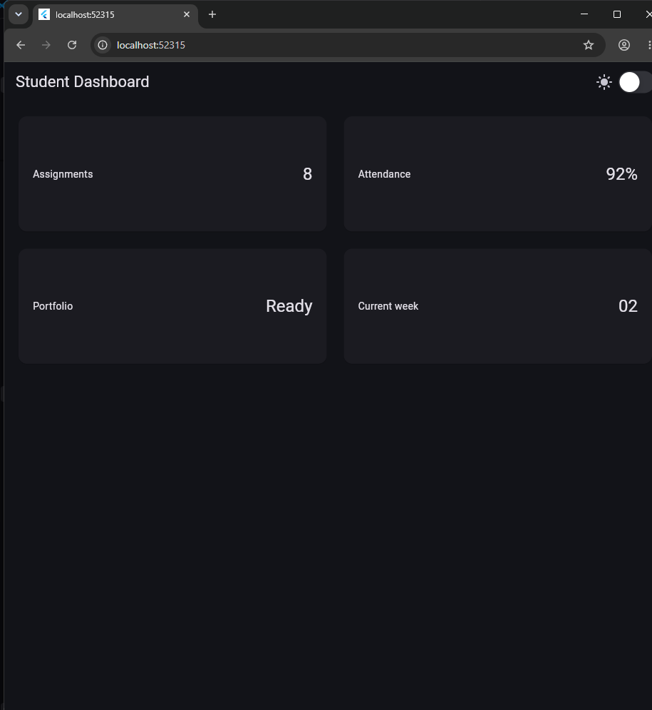
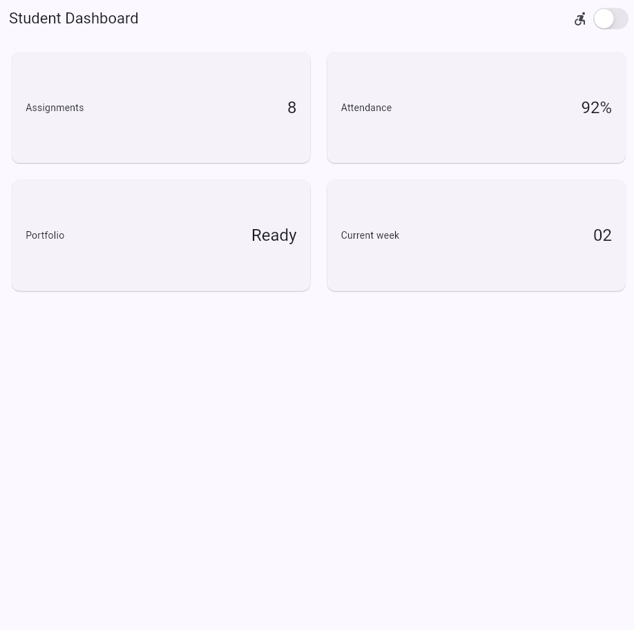
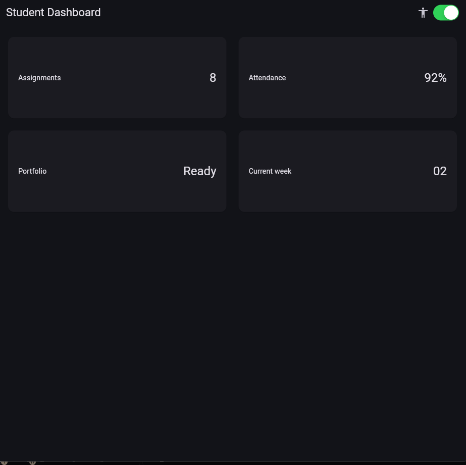
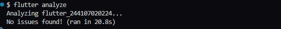
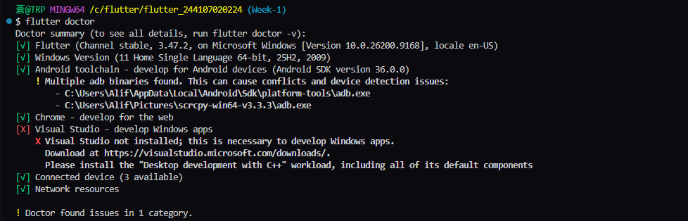

# Warm Up :

# Responsive Dashboard : 
##  Dark

## Light

## System ("My PC System use Dark Theme")

# Schematics 

# Fluter Analyze 

# Flutter Test

# Reflection & Questions

#### 1. How does imperative thinking differ from declarative thinking when building UI?
- **Imperative:** Manually mutate UI states step-by-step.
- **Declarative:** Describe the UI based on state; the framework automatically handles updates.

#### 2. When does Expanded help, and when can it cause a layout error?
- **Helps:** Forces a child to fill remaining flexible space inside a `Row`, `Column`, or `Flex`.
- **Causes error:** Used inside unconstrained layouts (like an unbounded scroll view) where space is infinite.

#### 3. How do breakpoints and themes affect user experience?
- **Breakpoints:** Adapt layouts smoothly across different screen sizes.
- **Themes:** Enhance readability and visual comfort across light and dark modes.

#### 4. What did you verify after receiving an AI design recommendation?
Confirmed responsiveness at different screen widths, checked that accessibility labels remained intact, and verified all widgets used stable Flutter APIs.
