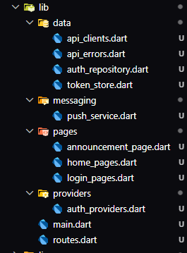
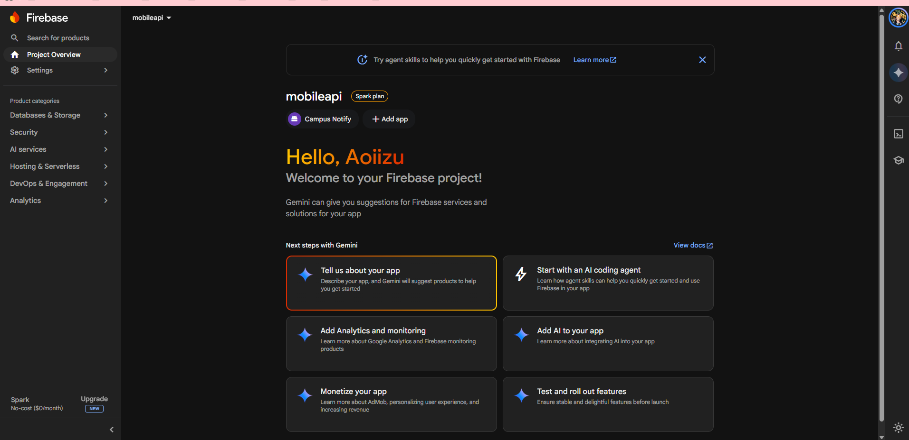
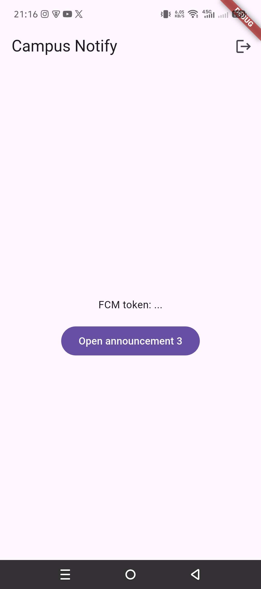

# Lab 1 

# Lab 2

# Lab 3

# Assignment

# Reflection 

## 1. Why must refresh tokens never live in SharedPreferences? What is the risk if one leaks?

SharedPreferences stores data as plain text in the app's sandbox. It can be read on a rooted device, pulled from an unencrypted backup, or stolen by malware. `flutter_secure_storage` uses Android Keystore / iOS Keychain, so the data stays encrypted.

A refresh token is long-lived and can create new access tokens. If it leaks, an attacker can keep getting valid access for weeks without the password, and the victim notices nothing. An access token is short-lived, so a leak is much less harmful.

## 2. What breaks if `onTokenRefresh` is ignored for a whole semester?

The backend keeps sending to an old token. FCM tokens change after a reinstall, a new phone, or cleared app data. Messages to the old token are silently dropped, so students stop getting important alerts like schedule changes. The database also fills with dead tokens. The fix is simple: listen to `onTokenRefresh` and send the new token to the backend.

## 3. When do you use a topic vs a device token?

- **Topic:** for a broadcast to a group. Example: "Library closes at 6 PM on Friday" sent to `campus-announcement`.
- **Device token:** for one specific person. Example: "Your thesis supervisor approved your room booking", which is personal data and must not go to a topic.

Rule of thumb: audience by interest means topic, audience by identity means device token.

## 4. Which part of the AI draft did you reject or fix, and why?

- **Token storage:** the draft used SharedPreferences. I replaced it with `flutter_secure_storage` because of question 1.
- **Refresh interceptor:** it had no guard, so a failed refresh could loop and several 401s caused several refresh calls. I added a `retried` flag so each request refreshes at most once, and a failed refresh clears the session and returns to `/login`.
